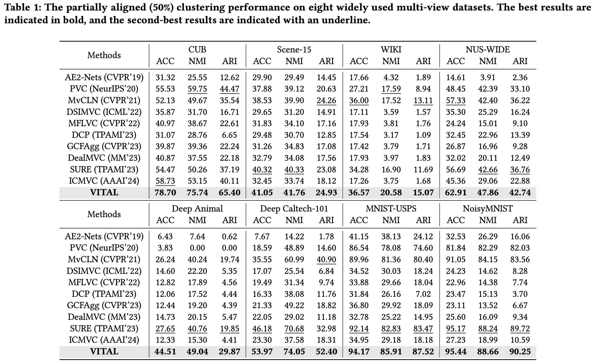
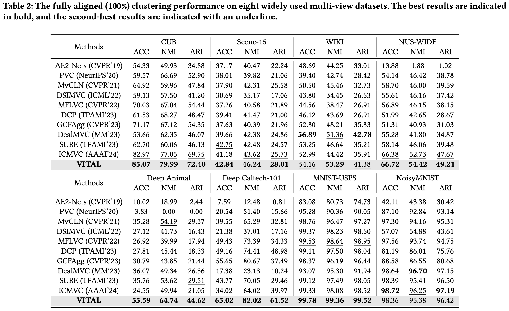

# 2024-MM-VITAL

[[ACM MM 2024](https://2024.acmmm.org/)] Code for the paper "[Robust Variational Contrastive Learning for Partially View-unaligned Clustering](https://dl.acm.org/doi/abs/10.1145/3664647.3681331/)]"

> [!IMPORTANT]
> **🎉 New Update:** The codebase now supports **more than 2 views**!
> - ✅ Complete multi-view clustering with **arbitrary number of views**
> - ✅ Partially View-unaligned (PVP) setting with **arbitrary number of views**
> - ⚡ **Faster training** with PyTorch-based GMM implementation (replacing sklearn's numpy-based GMM)


---

## Quick Start

### 1. Prepare Your Dataset

Modify the `load_data()` function in `run-multi-view-version.py` to load your own dataset:

```python
elif args.dataset_name == 'YourDataset':
    # Load each view into data_list
    data_list.append(mat['view1'])  # View 1: shape (n_samples, dim1)
    data_list.append(mat['view2'])  # View 2: shape (n_samples, dim2)
    data_list.append(mat['view3'])  # View 3: shape (n_samples, dim3) (optional)
    # ... add more views as needed
    label = np.squeeze(mat['label'].astype(np.uint8))
```

### 2. Configure Parameters

Key parameters in `run-multi-view-version.py`:

| Parameter | Description | Default |
|-----------|-------------|---------|
| `--dataset_name` | Name of your dataset | `'Scene15'` |
| `--dataset_path` | Path to dataset folder | `'./datasets/'` |
| `--aligned_rate` | Alignment ratio (1.0 = fully aligned, 0.5 = 50% PVP) | `1.0` |
| `--train_time` | Number of training runs for averaging | `5` |

### 3. Run Training

```bash
python run-multi-view-version.py --dataset_name 'YourDataset' --aligned_rate 0.5 --train_time 5
```

---

## Experiment Results

### Partially Aligned (50%) Clustering Performance



### Fully Aligned (100%) Clustering Performance



---

## Citation

If you find our work useful in your research, please consider citing:

```bibtex
@inproceedings{he2024robust,
  title={Robust Variational Contrastive Learning for Partially View-unaligned Clustering},
  author={He, Changhao and Zhu, Hongyuan and Hu, Peng and Peng, Xi},
  booktitle={Proceedings of the 32nd ACM International Conference on Multimedia},
  pages={4167--4176},
  year={2024}
}
```

