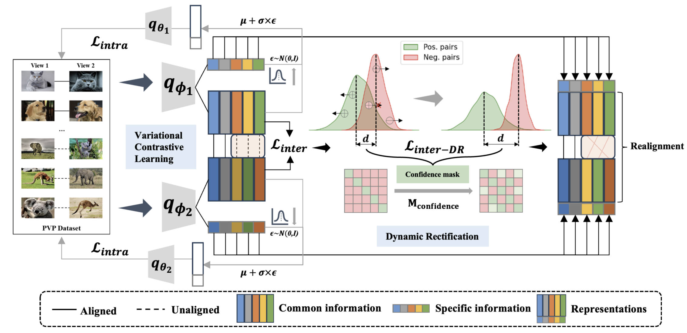
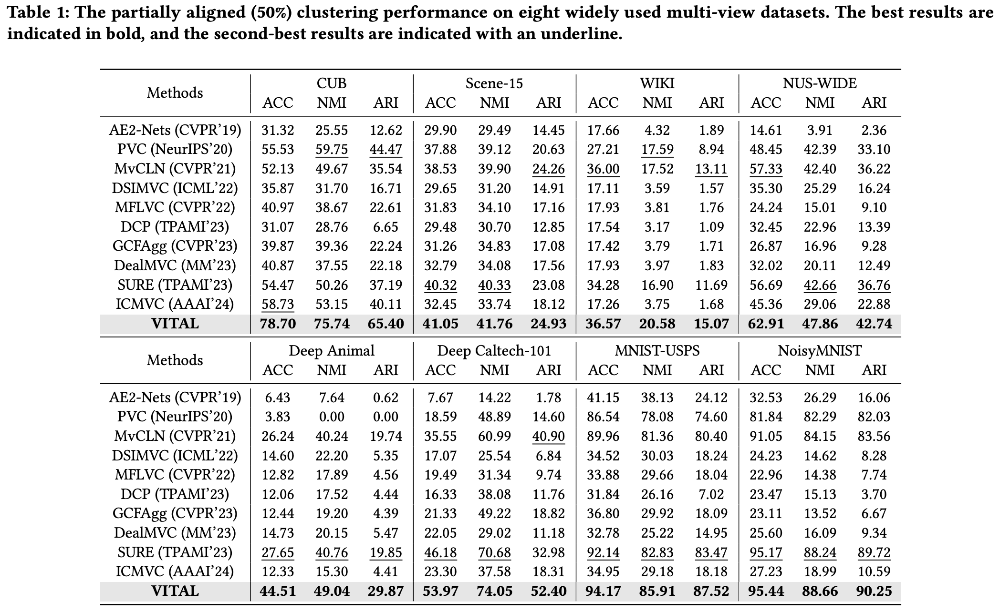
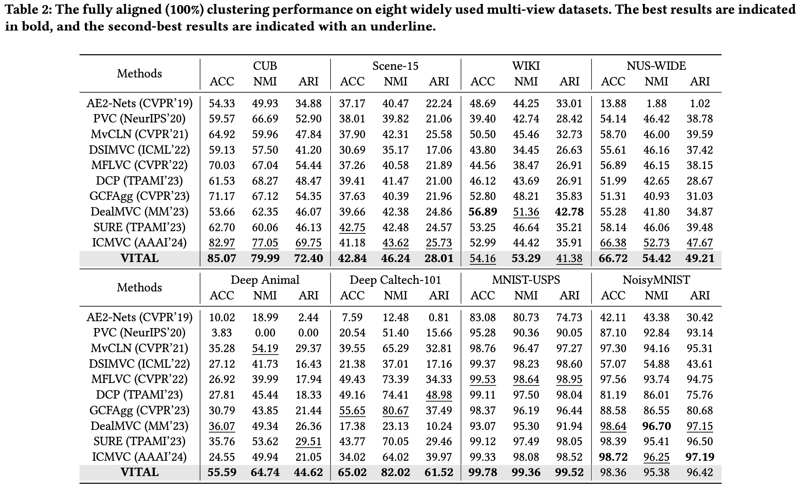

# 2024-MM-VITAL

[[ACM MM 2024](https://2024.acmmm.org/)] Code for the paper "[Robust Variational Contrastive Learning for Partially View-unaligned Clustering]([https://openreview.net/pdf?id=eZpm234cw2](https://dl.acm.org/doi/abs/10.1145/3664647.3681331))"



## Installation

1. Clone the repository:
    ```bash
    git clone https://github.com/He-Changhao/2024-MM-VITAL
    ```

2. Install the Python dependencies:
    ```plaintext
    numpy>=1.26.3
    scipy>=1.11.4
    scikit-learn>=1.4.0
    munkres>=1.1.4
    torch>=1.12.1
    matplotlib>=3.8.2
    pyyaml>=6.0.1
    ```

## Dataset and Configuration

The datasets used in our paper can be downloaded from [Google Drive](https://drive.google.com/drive/folders/1k3AkKiWD51ORoV11YZnmjbIZOnKp00n8?usp=sharing). Each dataset's configuration is written in a .yaml file located in the `config` folder. The parameters are explained in the `get_args_parser()` function in `run.py`. The structure of the datasets and their corresponding .yaml files should be as follows:

```
VITAL-path
    └─── datasets
        │   CUB.mat
        │   Deep Animal.mat
        │   Deep Caltech-101.mat
        │   MNIST-USPS.mat
        │   NoisyMNIST.mat
        │   NUS-WIDE.mat
        │   Scene-15.mat
        │   WIKI.mat
    └─── config
        │   CUB.yaml
        │   Deep Animal.yaml
        │   Deep Caltech-101.yaml
        │   MNIST-USPS.yaml
        │   NoisyMNIST.yaml
        │   NUS-WIDE.yaml
        │   Scene-15.yaml
        │   WIKI.yaml
```

If you need to add new datasets for training, please modify `dataloader.py` according to the existing dataset format and add the corresponding .yaml file to the `config` directory.

## Usage

All dataset parameters can be set by modifying the `./config/*.yaml` files. After editing the configuration file, you can train the model using the following command:

```bash
python vital_path/run.py --dataset_name 'CUB'
```

## Experiment Results

### The partially aligned (50%) clustering performance:



### The fully aligned (100%) clustering performance:



## Citation

If you find our work useful in your research, please consider citing:

```bibtex
@inproceedings{he2024robust,
  title={Robust Variational Contrastive Learning for Partially View-unaligned Clustering},
  author={He, Changhao and Zhu, Hongyuan and Hu, Peng and Peng, Xi},
  booktitle={Proceedings of the 32nd ACM International Conference on Multimedia},
  pages={4167--4176},
  year={2024}
}
```

